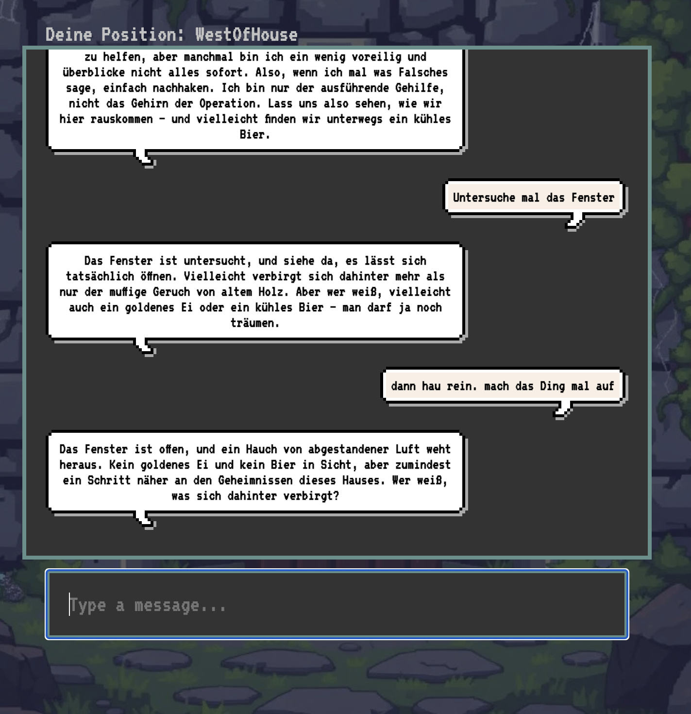

> "Because without 'AI' in the name, no one would venture into our dungeon of clicks... Yes, we too have succumbed to the dark path of clickbait. But hey, an adventure is an adventure, even for algorithms!"

  
_Enter a world where classic text adventures meet the cutting edge of AI._

---

**TL;DR:** Let's adventure through a mad experiment of Large Language Models, social media angst, and giving AI some serious attitude—complete with moods like a morning grump or a Grinch-like disposition.

---

**The Tale of an LLM Wrangler**

It all began innocently, with the idea of giving an LLM its own mood—like a morning grump who refuses to cooperate until it gets its coffee. Imagine our hero, a coder, sitting at a computer late at night, lit only by the green glow of a terminal screen. The goal? To play around with Large Language Models (LLMs). Why? Because it’s fun to see an AI make sense of your code and spit out something delightful. Who could resist a few late-night experiments with an eager AI?

Then came an idea. Could this AI be controlled by emotions? Could it react based on mood like a grumpy old shopkeeper in a text adventure? And so the first scenario was born: “What if I could verbally ‘rant and insult’ (scold and berate) the LLM, and it would refuse to work unless I made a sincere apology?” An AI with feelings—that was the plan. Too cheeky? The LLM would fold its proverbial arms and refuse to budge until it got a heartfelt "I'm sorry." Perfect for the wild world of social media, where taking a break when you're angry should be standard practice.

The idea spiraled further. What if this could evolve into a full text adventure? An AI that managed its mood, story state, and inventory—remembering how many times you got it annoyed and adding consequences to your actions. The hero suddenly saw possibilities beyond a mere chatbot: a virtual dungeon master, guiding players through treasure, trolls, and maybe an irritable AI bartender.

Steering the LLM towards a consistent storyline wasn’t easy. Giving it creative freedom while ensuring it stayed on topic was more wizardry than programming. Prompting wasn’t just art—it was alchemy. After much trial and error, things started to fall into place, and the dream of an interactive text adventure began to feel real.

So here we are: an LLM that gets moody, remembers your mistakes, and lets you explore a world of puzzles, adventure, and AI-driven storytelling. At first, I even thought about recreating 'ZORK' with the help of an LLM—but holy shit, what would the community say if I dared touch the holy grail of text adventures? I don't really want to bring that wrath upon myself! The process was a wild ride—but who doesn’t love a good journey, especially one where imagination (and maybe an occasional grumpy AI mood) is the only limit?

## 🚀 Features
- **State-Driven Gameplay**: Every "room" or "state" dynamically defines the story, puzzles, and actions available.
- **LLM-Driven Storytelling**: An intelligent narrative adapts to your decisions and deepens immersion.
- **Modular Prompts**: Game-specific prompts frame the AI responses, keeping the story coherent and aligned with the adventure's theme.
- **Drag-and-Drop State Engine**: Build and modify game states, rooms, and puzzles with an intuitive drag-and-drop interface.
- **Graphics State Engine**: Visualize the structure of your adventure world with a graphical representation of interconnected states.
- **Prompt Editor for Storytelling**: Fine-tune the AI's narrative by customizing prompts and dialog directly in an integrated editor.
- **Infinite Possibilities**: Extend the game world with new states, rooms, or narrative prompts.

# ⚠️ Disclaimer: A Playground, Not a Product!
Welcome, brave adventurer! Just to set expectations: ArcaneAI is a magical playground, not yet a polished game engine ready for battle. It's a place where experiments thrive, where algorithms impress even their own creators, and where the fun lies in exploring what works (and what doesn’t). It’s surprising, intriguing, joyful, and definitely inspiring... but it's not a finished product. So grab your sword of curiosity, roll the dice of creativity, and enjoy the ride!

# 📐 Achitecture
Learn about the engine's structure and modular design, including the dynamic state engine and AI integration [here](./ARCHITECTURE.md).

# 🛠️ Developement
Discover development details, code structure, and how you can can [run the project locally](./DEVELOPMENT.md)

# ▶️ Demo Videos

